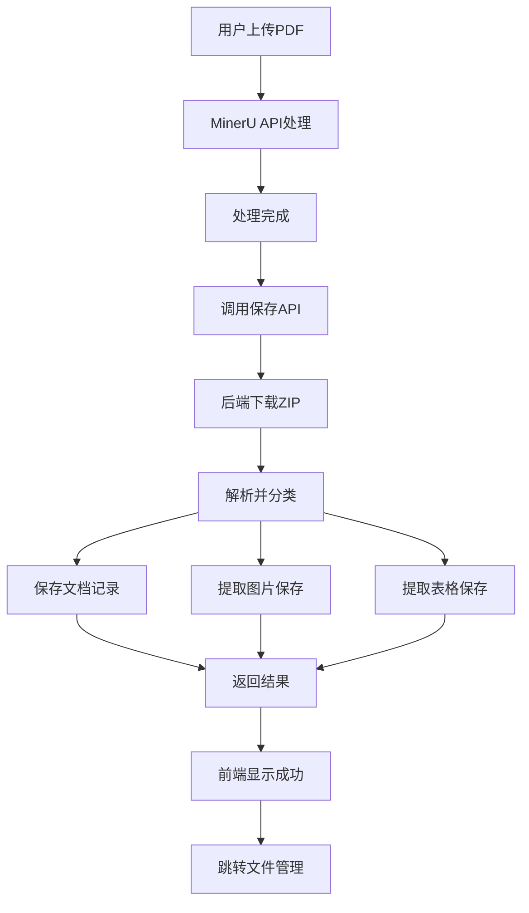

# 📚 地质文档数字化与文件管理系统

## 🎯 系统概述

本系统实现了**文档数字化处理**与**文件资源管理**的完整闭环，支持：

1. 📄 **文档数字化** - 使用MinerU API处理PDF文档
2. 📋 **文件管理** - 统一管理所有文档文件
3. 🖼️ **图库管理** - 自动提取和管理图片资源
4. 📊 **表库管理** - 自动提取和管理数据表格

---

## 🌟 核心特性

### ✨ 一体化工作流

```
文档上传 → 智能处理 → 自动分类 → 统一管理
```

### 🎨 现代化UI

- 紫色渐变主题
- 标签页切换设计
- 响应式布局
- 流畅动画效果

### 🔗 数据关联

- 图片和表格关联源文档
- 支持追溯来源
- 批量操作管理

---

## 📁 项目结构

```
mapView-main/
├── src/
│   ├── views/
│   │   ├── HomePage.vue                      # 主页
│   │   ├── DocumentDigitalizationPage.vue    # 文档数字化
│   │   ├── FileListPage.vue                  # 文件管理中心（三合一）
│   │   └── DocumentPreviewPage.vue           # 文档预览
│   ├── components/
│   │   ├── FilePagination.vue                # 文件列表组件
│   │   ├── ImageGallery.vue                  # 图库组件
│   │   ├── TableLibrary.vue                  # 表库组件
│   │   └── ...
│   ├── api/
│   │   ├── integration.ts                    # API集成（新建）
│   │   ├── mineruApi.ts                      # MinerU API
│   │   └── documentApi.ts                    # 文档API定义
│   └── router/
│       └── index.ts                          # 路由配置
├── 文档数字化与文件管理集成方案.md           # 完整技术方案 ⭐
├── 后端API接口清单.md                         # API接口清单 ⭐
├── 前端集成示例代码.md                        # 前端代码示例 ⭐
├── 文件管理中心说明.md                        # 用户使用手册
└── README_文件管理系统.md                     # 本文档
```

---

## 🚀 快速开始

### 1. 前端开发

```bash
# 安装依赖
npm install

# 启动开发服务器
npm run dev

# 访问应用
http://localhost:5173
```

### 2. 环境配置

创建 `.env.development` 文件：

```env
# 文档服务API
VITE_DOCUMENT_API=http://localhost:8080/api/documents

# 图库服务API
VITE_IMAGE_API=http://localhost:8081/api/images

# 表库服务API
VITE_TABLE_API=http://localhost:8082/api/tables

# MinerU API配置
VITE_MINERU_API_TOKEN=your_token_here
```

### 3. 后端准备

参考文档：
- 📖 `后端API接口清单.md` - 接口规范
- 📖 `文档数字化与文件管理集成方案.md` - 完整方案

---

## 📋 功能清单

### 📄 文档数字化页面

| 功能 | 状态 | 说明 |
|------|------|------|
| 本地文件上传 | ✅ | 支持拖拽和选择 |
| URL上传 | ✅ | 支持在线文件 |
| MinerU API处理 | ✅ | 智能OCR识别 |
| 实时进度显示 | ✅ | 进度条和状态更新 |
| 结果预览 | ✅ | Markdown和PDF对比 |
| **保存到文件管理** | ⏳ | 待后端对接 |

### 📋 文件管理中心

| 功能 | 状态 | 说明 |
|------|------|------|
| 标签页切换 | ✅ | 文件/图库/表库 |
| 文件列表展示 | ✅ | 表格视图 |
| 图库网格/列表视图 | ✅ | 双视图模式 |
| 表库卡片展示 | ✅ | 直观展示 |
| 搜索和筛选 | ✅ | 多条件筛选 |
| 批量操作 | ✅ | 批量删除等 |
| **数据持久化** | ⏳ | 待后端对接 |

---

## 🔌 API集成状态

### 已完成（前端）

- ✅ API客户端封装 (`src/api/integration.ts`)
- ✅ 文档保存接口调用
- ✅ 列表查询接口
- ✅ 上传接口
- ✅ 删除接口
- ✅ 错误处理

### 待实现（后端）

- ⏳ 文档管理服务 (8080端口)
- ⏳ 图库管理服务 (8081端口)
- ⏳ 表库管理服务 (8082端口)
- ⏳ ZIP文件解析
- ⏳ 图片和表格提取
- ⏳ 数据库存储

---

## 🗄️ 数据库设计

### 三个独立数据库

```
documents_db  ← 存储文档信息
images_db     ← 存储图片信息
tables_db     ← 存储表格信息
```

### 核心表结构

```sql
-- 文档表
CREATE TABLE documents (
    id VARCHAR(50) PRIMARY KEY,
    file_name VARCHAR(255) NOT NULL,
    file_type VARCHAR(50),
    file_size BIGINT,
    original_url TEXT,
    result_url TEXT,
    status VARCHAR(20),
    source VARCHAR(50),
    created_at TIMESTAMP
);

-- 图片表
CREATE TABLE images (
    id VARCHAR(50) PRIMARY KEY,
    image_name VARCHAR(255) NOT NULL,
    image_url TEXT NOT NULL,
    category VARCHAR(50),
    file_size BIGINT,
    source VARCHAR(50),
    source_document_id VARCHAR(50),
    created_at TIMESTAMP
);

-- 表格表
CREATE TABLE tables (
    id VARCHAR(50) PRIMARY KEY,
    table_name VARCHAR(255) NOT NULL,
    description TEXT,
    category VARCHAR(50),
    table_type VARCHAR(20),
    file_url TEXT NOT NULL,
    row_count INT,
    column_count INT,
    source VARCHAR(50),
    source_document_id VARCHAR(50),
    created_at TIMESTAMP
);
```

---

## 📊 完整业务流程

### 场景：用户上传PDF进行数字化



### 关键步骤

1. **前端上传** (`DocumentDigitalizationPage.vue`)
   ```typescript
   const result = await mineruApi.createExtractTask(fileUrl);
   await pollTaskUntilComplete(result.task_id);
   ```

2. **保存结果** (`DocumentDigitalizationPage.vue`)
   ```typescript
   const saveResult = await saveDigitalizationResult({
     fileName, fileType, fileSize,
     originalUrl, resultUrl, mineruTaskId, status
   });
   ```

3. **后端处理** (待实现)
   ```python
   # 1. 保存文档记录
   document_id = save_document(data)
   
   # 2. 下载ZIP
   zip_path = download_file(data.result_url)
   
   # 3. 提取并保存
   images = extract_images(zip_path)
   tables = extract_tables(zip_path)
   
   save_images(document_id, images)
   save_tables(document_id, tables)
   ```

4. **前端展示** (`FileListPage.vue`)
   ```typescript
   // 高亮显示新文档
   router.push({
     path: '/file-list',
     query: { highlight: documentId }
   });
   ```

---

## 📖 文档索引

### 🎯 给前端开发者

1. **`前端集成示例代码.md`** ⭐
   - 完整的代码示例
   - API调用方法
   - 组件集成步骤

2. **`文件管理中心说明.md`**
   - 用户界面说明
   - 功能使用指南
   - 操作流程

### 🎯 给后端开发者

1. **`后端API接口清单.md`** ⭐
   - 19个API接口
   - 请求响应示例
   - 优先级标注

2. **`文档数字化与文件管理集成方案.md`** ⭐
   - 完整技术方案
   - 数据库设计
   - 业务流程
   - 实现建议

---

## 🔥 核心优势

### 1. 自动化处理

- ✅ 文档上传后自动处理
- ✅ 自动提取图片和表格
- ✅ 自动分类存储
- ✅ 自动生成关联

### 2. 一体化管理

- ✅ 文件/图库/表库三合一界面
- ✅ 标签页快速切换
- ✅ 统一的操作体验
- ✅ 完整的追溯链

### 3. 数据关联

```
文档 → 图片（记录来源文档）
文档 → 表格（记录来源文档）
图片 → 点击可查看源文档
表格 → 点击可查看源文档
```

### 4. 灵活扩展

- ✅ 组件化设计
- ✅ API分离
- ✅ 数据库独立
- ✅ 易于维护

---

## 🎨 UI截图（示意）

### 主页
```
┌─────────────────────────────────┐
│  功能控制                        │
│  ┌─────┐  ┌─────┐  ┌─────┐     │
│  │🌍   │  │📋   │  │📏   │     │
│  │文档 │  │文件 │  │测量 │     │
│  └─────┘  └─────┘  └─────┘     │
└─────────────────────────────────┘
```

### 文件管理中心
```
┌─────────────────────────────────────┐
│ ← 返回  文件管理中心       👤 管理员│
├─────────────────────────────────────┤
│ 📋 文件列表 | 🖼️ 我的图库 | 📊 我的表库 │
├─────────────────────────────────────┤
│                                      │
│  [文件卡片] [文件卡片] [文件卡片]    │
│  [文件卡片] [文件卡片] [文件卡片]    │
│                                      │
└─────────────────────────────────────┘
```

---

## 🚦 开发路线图

### Phase 1: 前端界面（已完成 ✅）

- ✅ 文件管理中心页面
- ✅ 三个标签页组件
- ✅ 路由配置
- ✅ API接口封装

### Phase 2: API集成（进行中 🔄）

- ✅ 前端API客户端
- ⏳ 后端API实现
- ⏳ 数据库创建
- ⏳ ZIP解析功能

### Phase 3: 功能完善（计划中 📅）

- ⏳ 文件预览增强
- ⏳ 批量上传优化
- ⏳ 搜索功能增强
- ⏳ 数据导出功能

### Phase 4: 生产就绪（计划中 📅）

- ⏳ 性能优化
- ⏳ 错误处理完善
- ⏳ 日志和监控
- ⏳ 部署文档

---

## 💡 使用示例

### 完整工作流

```typescript
// 1. 用户在文档数字化页面上传PDF
const file = await uploadFile('geology-report.pdf');

// 2. 系统自动处理
const taskId = await mineruApi.createTask(file);
const result = await pollTask(taskId);

// 3. 自动保存到文件管理
const saved = await saveDigitalizationResult({
  fileName: 'geology-report.pdf',
  resultUrl: result.full_zip_url,
  // ...其他参数
});

// 4. 后端自动提取
// - 提取了5张图片到图库
// - 提取了3个表格到表库

// 5. 用户在文件管理中心查看
// - 📋 文件列表：看到新文档
// - 🖼️ 我的图库：看到5张提取的图片
// - 📊 我的表库：看到3个提取的表格
```

---

## 🛠️ 技术栈

### 前端

- **框架**: Vue 3 + TypeScript
- **路由**: Vue Router
- **UI**: Element Plus
- **HTTP**: Axios
- **构建**: Vite

### 后端（建议）

- **语言**: Java / Python / Node.js
- **框架**: Spring Boot / FastAPI / Express
- **数据库**: MySQL 8.0+ / PostgreSQL
- **存储**: 阿里云OSS / MinIO

---

## 📝 待办事项

### 高优先级 🔴

- [ ] 实现后端文档保存API
- [ ] 实现ZIP文件解析
- [ ] 实现图片和表格提取
- [ ] 连接真实数据库

### 中优先级 🟡

- [ ] 实现文件下载功能
- [ ] 实现详情查看功能
- [ ] 优化错误处理
- [ ] 添加加载动画

### 低优先级 🟢

- [ ] 添加文件预览
- [ ] 实现批量下载
- [ ] 添加文件标签
- [ ] 实现搜索建议

---

## 🤝 贡献指南

### 前端开发者

1. 查看 `前端集成示例代码.md`
2. 按照示例修改组件
3. 测试API调用
4. 提交代码

### 后端开发者

1. 查看 `后端API接口清单.md`
2. 查看 `文档数字化与文件管理集成方案.md`
3. 实现API接口
4. 测试数据流

---

## 📞 联系方式

如有问题，请：

1. 查看相关文档
2. 检查环境配置
3. 查看网络请求
4. 联系项目负责人

---

## 🎉 总结

本系统通过**前后端分离**的设计，实现了：

1. ✅ **完整的文档数字化流程**
2. ✅ **统一的文件资源管理**
3. ✅ **自动化的内容提取**
4. ✅ **灵活的数据关联**

前端界面已完成，**等待后端API对接即可投入使用**！

---

**🚀 准备好了吗？让我们开始对接后端吧！**

